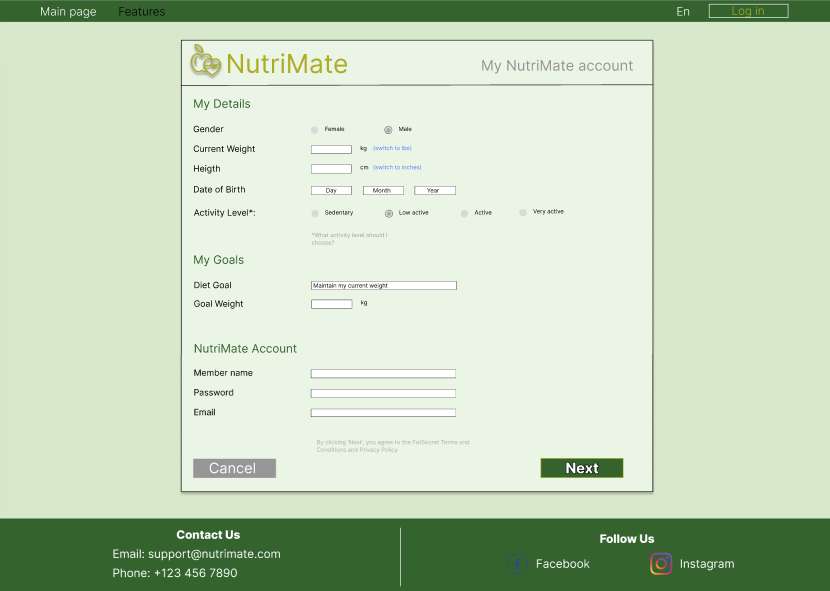
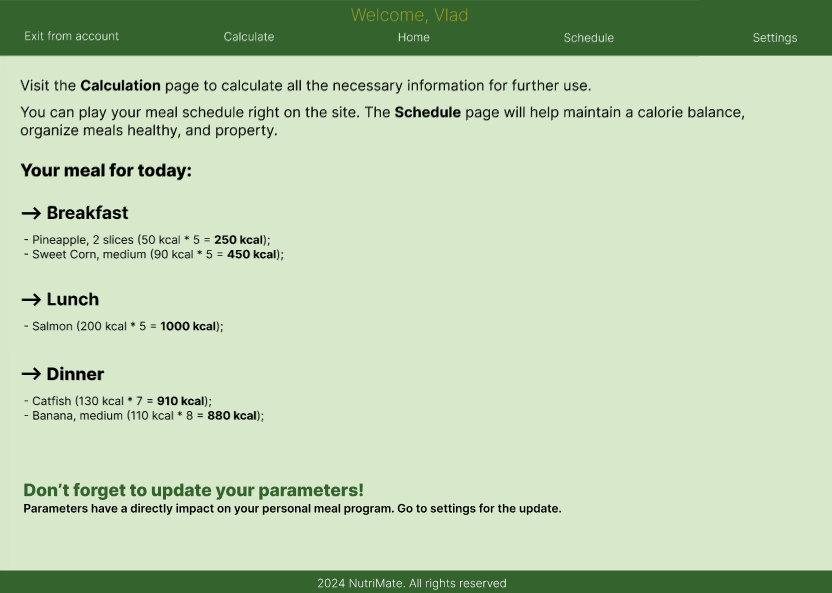
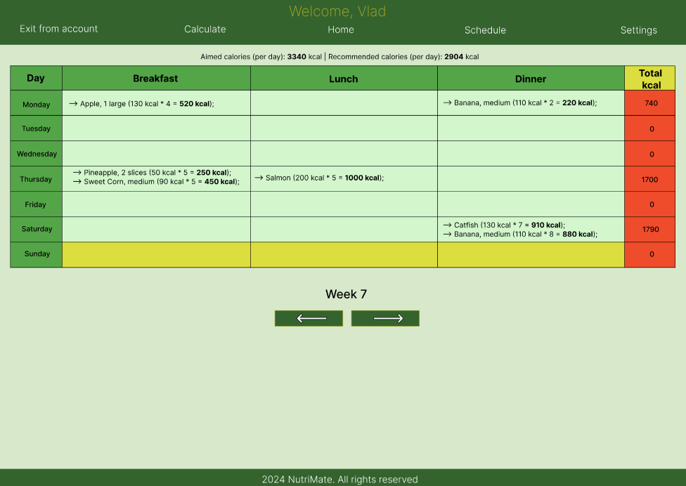

# IC-32_Vladyslav_Kiselar_NutriMate_Lab1

### Сервіс для підрахунку калорій

Сервіс для підрахунку калорій допомагає користувачам контролювати харчування, забезпечуючи зручний спосіб відстеження спожитих поживних речовин. Перед початком використання, користувач вказує свої цілі, такі як схуднення, набір ваги або підтримання поточного стану, а система автоматично розраховує необхідну добову норму калорій і макронутрієнтів для досягнення цієї мети. На основі спланованого харчування, користувач може відстежувати, скільки білків, жирів, вуглеводів та інших речовин він спожив протягом дня. Додатково, сервіс зберігає історію споживаної їжі, що дозволяє аналізувати раціон у довгостроковій перспективі, коригувати його і слідкувати за прогресом у досягненні поставлених цілей.

### Прототипи сторінок:

#### Main start page:

#### Features page:

#### Registration page:

#### Login page:

#### Home page:

#### Calculate page:

#### Schedule page:

#### History page:

#### Settings page:

